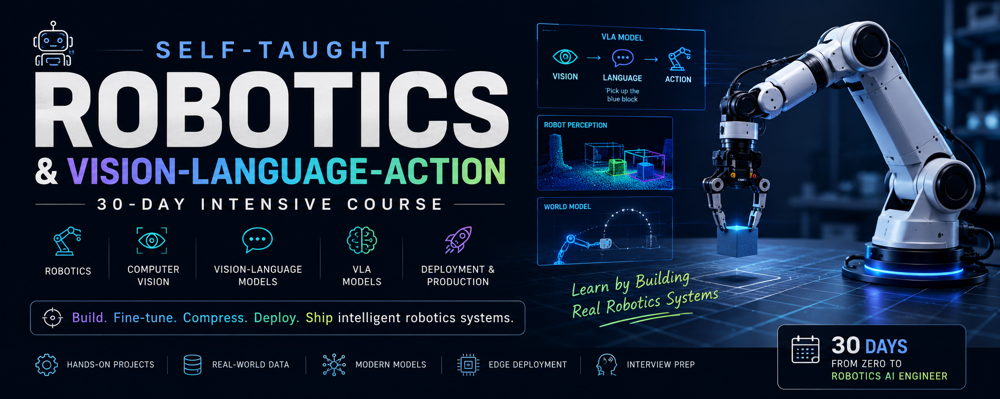

# 🚀 Self-Taught Robotics & Vision-Language-Action (VLA) Course

> A comprehensive 30-day intensive roadmap to become an Applied Robotics AI Engineer through hands-on projects, Vision-Language-Action models, robot perception, multimodal AI, and production deployment.

<p align="center">
  
</p>


---

## 📖 Overview

This repository contains my complete **30-day self-taught robotics curriculum** focused on modern AI for robotics.

Unlike traditional robotics courses that spend months on theory, this curriculum is designed around **building real systems**. Every day introduces a new concept and immediately applies it to practical robotics problems.

The end goal is to build, fine-tune, compress, and deploy a **Vision-Language-Action (VLA)** model capable of robotic reasoning.

The course combines:

- 🤖 Robotics
- 👁️ Computer Vision
- 🧠 Vision-Language Models
- 🚀 Vision-Language-Action Models
- 📦 Model Compression
- ☁️ Production Deployment
- 🏗️ System Design
- 💻 Coding Interviews

---

# 🎯 Learning Goals

By the end of this course you will understand how to:

- Build robot perception pipelines
- Work with modern Vision-Language Models
- Fine-tune Vision-Language-Action models
- Generate synthetic demonstrations
- Train LoRA adapters
- Deploy robotics models efficiently
- Compress models for edge devices
- Build production-ready robotics applications
- Prepare for Robotics AI interviews

---

# 🗓️ 30-Day Curriculum

## Week 1 — Foundations

- AI Landscape
- Environment Setup
- Vision-Language Models
- Milvus
- Diffusion Models
- Vision Transformers
- Segment Anything
- NeRF & 3D Gaussian Splatting
- Robot Perception

---

## Week 2 — Robot Perception

- Object Detection
- Depth Estimation
- Pose Estimation
- Grasp Detection
- SLAM
- Spatial Mapping
- Pipeline Integration

---

## Week 3 — Vision-Language-Action

- VLA Architecture
- LoRA Fine-tuning
- Synthetic Demonstrations
- Data Generation
- ControlNet
- World Models

---

## Week 4 — Deployment

- Quantization
- Compression
- Edge Deployment
- Evaluation
- System Design
- ML Fundamentals

---

## Week 5 — Production

- Interview Preparation
- Product Building
- Packaging
- Documentation
- Portfolio
- Demo

---

# 📂 Repository Structure

```
.
├── obsidian_vault/
│   ├── Day01.md
│   ├── Day02.md
│   ├── ...
│   ├── Dashboard.md
│   ├── Capstone_VLA.md
│   └── Retention.md
│
├── assignment/
│   ├── Day01_*.py
│   ├── Day02_*.py
│   ├── ...
│   └── README.md
│
├── vla-edge/
│   ├── src/
│   ├── tests/
│   ├── benchmarks/
│   ├── demo/
│   ├── checkpoints/
│   └── requirements.txt
│
└── README.md
```

---

# 📚 Course Components

## 📝 Obsidian Vault

Contains all daily notes including

- Theory
- Reading material
- Daily tasks
- Interview questions
- Retention exercises
- Progress dashboard

---

## 💻 Coding Assignments

Every day includes hands-on coding exercises.

Assignments are designed to reinforce concepts through implementation instead of passive reading.

Topics include

- Milvus
- Vision Models
- Diffusion
- LoRA
- Quantization
- Robotics Pipelines
- Attention
- Anomaly Detection
- DreamerV3

---

## 🤖 VLA Edge Project

The course culminates in a production-ready repository containing

- Training
- Evaluation
- Compression
- Deployment
- Configuration
- Benchmarks
- Testing

This project serves as the portfolio piece built throughout the course.

---

# 🛠 Technologies

- Python
- PyTorch
- Transformers
- Hugging Face
- LeRobot
- Milvus
- OpenCV
- Vision Transformers
- Diffusers
- LoRA
- GPTQ
- AWQ
- DreamerV3

---

# 🚀 Getting Started

Clone the repository

```bash
git clone https://github.com/theja-vanka/robotics-course.git
cd robotics-course
```

Install dependencies

```bash
pip install -r vla-edge/requirements.txt
```

Open the learning materials

```text
obsidian_vault/
```

Begin with

```
Day01.md
```

and progress sequentially through the curriculum.

---

# 📈 Learning Philosophy

This repository follows a simple principle:

> Learn by building.

Each day consists of

- 📖 Learn
- 🧠 Understand
- 💻 Implement
- 🚀 Build
- ✅ Test
- 🔁 Review

Rather than watching hours of videos, you'll spend most of your time implementing real robotics systems.

---

# 🎓 Capstone Project

Throughout the course you'll progressively build a Vision-Language-Action system that includes:

- Robot perception
- VLM reasoning
- LoRA fine-tuning
- Synthetic demonstrations
- Edge deployment
- Model compression
- Evaluation pipeline

By the final week you'll have a complete robotics AI project suitable for your portfolio.

---

# 🤝 Contributing

Contributions are welcome!

If you'd like to improve the curriculum, fix issues, or add new learning resources, feel free to open an issue or submit a pull request.

---

# ⭐ Support

If this repository helps you learn Robotics AI, consider giving it a ⭐ to support the project.

---

# 📄 License

This project is released under the MIT License.