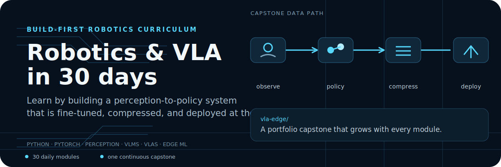
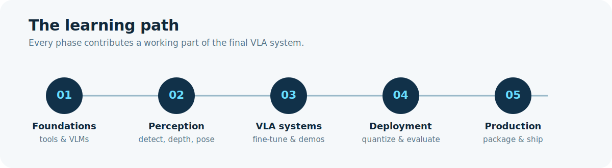

<p align="center">
  
</p>

<p align="center"><a href="#start-here">Start here</a> · <a href="#the-capstone">Explore the capstone</a> · <a href="#curriculum">See the curriculum</a></p>

## Build a robotics AI portfolio, one working system at a time

This is a 30-day, self-directed curriculum for aspiring applied robotics AI engineers. Rather than separating theory from practice, each module adds a capability to a continuous capstone: a Vision-Language-Action (VLA) policy that can observe a scene, choose an action, be fine-tuned, compressed, evaluated, and prepared for edge deployment.

<p align="center"></p>

## The capstone

[`vla-edge/`](./vla-edge/) is the repository that turns the coursework into a concrete portfolio artifact. Its modules map directly to the pipeline you will build:

```text
camera frame → structured observation → VLA policy → fine-tune → compress → deploy → evaluate
```

| Module | What you build |
| --- | --- |
| [`observe.py`](./vla-edge/src/observe.py) | Perception that turns frames into structured observations. |
| [`policy.py`](./vla-edge/src/policy.py) | A runnable SmolVLA policy and action interface. |
| [`train_lora.py`](./vla-edge/src/train_lora.py) | LoRA fine-tuning for a chosen task. |
| [`compress.py`](./vla-edge/src/compress.py) | 4-bit / quantization experiments with measurements. |
| [`deploy.py`](./vla-edge/src/deploy.py) | Edge-oriented inference and latency benchmarking. |
| [`eval.py`](./vla-edge/src/eval.py) | Success-rate evaluation and benchmark output. |

The capstone README explains its problem, module order, validation approach, and results table: [open `vla-edge`](./vla-edge/README.md).

## Curriculum

The course moves from fundamentals to a production-minded robotics system. The notes live in the [`obsidian_vault/`](./obsidian_vault/) and the corresponding implementation exercises are in [`starter_code/`](./starter_code/).

| Phase | Focus | Representative topics |
| --- | --- | --- |
| Foundations | Establish the AI and robotics toolchain. | Python, VLMs, Milvus, diffusion, vision transformers, 3D scene representations. |
| Robot perception | Give the system a usable model of its surroundings. | Detection, depth, pose estimation, grasping, SLAM, spatial mapping. |
| Vision-Language-Action | Connect perception and language-guided control. | VLA architecture, LoRA, retrieval, synthetic demonstrations, world models. |
| Deployment | Make the system measurable and practical. | Quantization, compression, latency, edge deployment, evaluation. |
| Production | Turn the work into an interview-ready artifact. | Packaging, documentation, portfolio, demo, system design. |

## Start here

```bash
git clone https://github.com/theja-vanka/robotics-course.git
cd robotics-course
pip install -r vla-edge/requirements.txt
```

Then open [`obsidian_vault/Day01.md`](./obsidian_vault/Day01.md), work through the daily material in sequence, and use [`starter_code/`](./starter_code/) to implement each exercise.

To work on the capstone directly:

```bash
cd vla-edge
pytest tests/ -q
```

The supplied helpers pass first; the intentionally incomplete functions point to the next implementation milestone. See [`vla-edge/README.md`](./vla-edge/README.md) for the recommended order.

## What you will practice

- Building robot perception pipelines with detection, depth, pose, grasping, and mapping.
- Working with vision-language models and Vision-Language-Action policies.
- Fine-tuning with LoRA and creating or augmenting demonstrations.
- Evaluating trade-offs among task quality, model size, and latency.
- Compressing and packaging a model for an edge-oriented deployment path.
- Explaining the system clearly through benchmarks, documentation, and a portfolio demo.

## Learning rhythm

Each day follows the same loop: learn the concept, implement a focused piece, test it, and connect it back to the capstone. The Obsidian vault includes the [progress dashboard](./obsidian_vault/Dashboard.md), retention exercises, a part-time roadmap, and the [capstone plan](./obsidian_vault/Capstone_VLA.md).

## Technology surface

Python · PyTorch · Transformers · Hugging Face · LeRobot · Milvus · OpenCV · Vision Transformers · Diffusers · LoRA · GPTQ · AWQ · DreamerV3

## Contributing

Suggestions, fixes, and learning resources are welcome. Please open an issue or pull request with enough context to help another learner use the improvement.

## License

MIT
